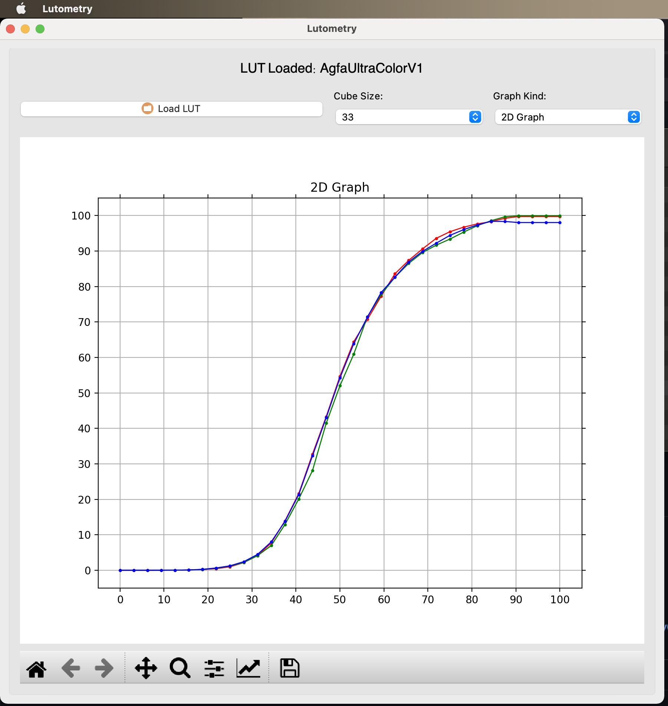

# Lutometry
Visualize LUTs as a graph or cube. Open source, built on top of <a href = "https://github.com/gregcotten/pylut">pyLUT</a>.

Released under the MIT License. All images are Creative Commons.

The latest stable version for Mac OS:
 Version 0.1
 <b>NOTE:</b>Currently only loads .cube files

MacOS Download:
http://www.AJYoungDP.com/downloads/Lutometry-MacOS-v0.1.zip

